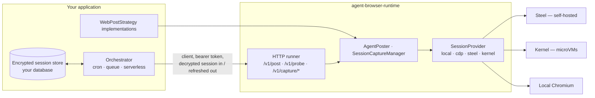

# ABR: Agent Browser Runtime

**Let your agent act as the user - in their own logged-in browser session - on infrastructure you control.**

[](https://github.com/praveen-palanisamy/agent-browser-runtime/actions/workflows/ci.yml)
[](https://www.npmjs.com/package/@praveen-palanisamy/agent-browser-runtime)
[](LICENSE)

`agent-browser-runtime` is a small, self-hostable runtime for **stateful, secure browser-session execution**. You capture a user's authenticated session once (they sign in inside a live view; you never see a password), store it encrypted in *your* database, and from then on any scheduled or event-driven job can open a fresh isolated browser, inject that session, drive the site's real UI with verification, and hand back the rotated cookies — without the user's laptop being online and without a developer API.

It is the missing layer between "I have Playwright" and "I can run unattended, per-user, authenticated browser jobs in production":

| Problem | What ABR gives you |
|---------|----------------------------|
| Platforms without a (usable/affordable) API | Ability to drive the real web UI with the user's own session |
| Sessions live on the user's machine | Portable `storageState` you persist encrypted; runs on your servers |
| Cookies rotate, sessions expire | Every job returns the refreshed session; `needsReauth` is a first-class outcome |
| "Did it actually post?" | Strategies must verify; `uncertain` results are separated from failures so you never double-act |
| Browser infra is painful | One `SessionProvider` contract over local Chromium, any CDP endpoint, self-hosted [Steel](https://github.com/steel-dev/steel-browser), or [Kernel](https://www.kernel.sh) microVMs |
| Serverless can't run Chromium | An HTTP runner service + a Playwright-free client for functions, queues, and cron |
| Users need to sign in somewhere safe | Interactive capture with an embeddable, proxied live view and unguessable, expiring capture ids |

No browser engine is reinvented here: the runtime orchestrates proven engines (Playwright, Steel, Kernel) and owns the parts they leave to you — session lifecycle, verification contracts, pacing, isolation per job, and a stable wire protocol.

## Use cases

- **Social publishing as the user** — schedule posts to platforms whose APIs are metered or closed; fall back to the API only when the session is gone.
- **Autonomous assistants** that file expense reports, update CRMs, or download statements from portals with no API.
- **Per-tenant SaaS automations** where each customer's session must stay isolated and encrypted under your keys.
- **Agent frameworks / MCP tools** that need a durable "act on behalf of this user" primitive with re-auth signalling instead of silent failures.
- **Health probes** that tell users *before* a scheduled job fails that they need to sign in again.

## How it fits together



The runtime is **stateless between requests**: sessions are never persisted by it, every job runs in a fresh browser context that is closed afterwards, and the only in-memory state is an in-flight interactive capture.

## Quick start

```bash
npm i @praveen-palanisamy/agent-browser-runtime
npx playwright-core install chromium        # local provider
```

### 1. Describe a platform (`WebPostStrategy`)

```ts
import type { WebPostStrategy } from '@praveen-palanisamy/agent-browser-runtime';

export const noteStrategy: WebPostStrategy = {
  platform: 'notes-app',
  loginUrl: 'https://notes.example/login',
  validate: (c) => (c.text.length > 500 ? 'Too long' : null),
  async isAuthenticated(ctx) {
    const page = await ctx.newPage();
    await page.goto('https://notes.example/');
    return page.locator('[data-testid="avatar"]').isVisible();
  },
  async post(ctx, content) {
    const page = await ctx.newPage();
    await page.goto('https://notes.example/new');
    await page.fill('textarea', content.text);
    await page.click('button[type=submit]');
    const url = await page.locator('a.permalink').getAttribute('href');
    return url
      ? { ok: true, platformPostUrl: url, verification: 'toast' }
      : { ok: false, uncertain: true, failureStage: 'verify' };
  },
};
```

### 2. Run it as a service

```ts
import { startRunner } from '@praveen-palanisamy/agent-browser-runtime/service';
startRunner({ strategies: [noteStrategy] });
```

or with the CLI and a module exporting `WebPostStrategy[]` (see [`examples/demo-strategy`](examples/demo-strategy/index.js)):

```bash
AGENT_RUNNER_TOKEN=$(openssl rand -base64 32) \
  npx agent-browser-runtime serve --strategies ./strategies.js
```

### 3. Call it from anywhere (no Playwright needed)

```ts
import { AgentRunnerClient } from '@praveen-palanisamy/agent-browser-runtime/client';

const runner = new AgentRunnerClient({ baseUrl, token });

// one-time: user signs in inside the live view you embed
const { captureId, liveViewUrl } = await runner.captureStart({ platform: 'notes-app' });
// ... user finishes ...
const done = await runner.captureFinish({ captureId });
if (done.ok) await vault.save(userId, encrypt(done.state));

// later, unattended
const res = await runner.post({
  workspaceId, accountId, platform: 'notes-app', jobId,
  session: decrypt(await vault.load(userId)),
  content: { text: 'hello' },
});
if (res.refreshedSession) await vault.save(userId, encrypt(res.refreshedSession));
if (res.needsReauth) notifyUserToReauthorize();
if (res.uncertain) flagForManualReview();   // never retry blindly
```

### Library-only (no HTTP)

```ts
import { AgentPoster, SteelSessionProvider } from '@praveen-palanisamy/agent-browser-runtime';

const poster = new AgentPoster(
  new SteelSessionProvider({ baseUrl: 'http://steel:3000' }),
  myEncryptedStore
).register(noteStrategy);
await poster.post({ workspaceId, accountId, platform: 'notes-app', content: { text } });
```

## Contracts

| Contract | Responsibility | Provided implementations |
|----------|----------------|--------------------------|
| `SessionStore` | Persist/load `AgentSessionState` (Playwright `storageState` + UA + timestamps) | `InMemorySessionStore`; you implement the encrypted one |
| `SessionProvider` | Turn a stored state into a live `BrowserContext` | `LocalBrowserSessionProvider`, `CdpSessionProvider`, `SteelSessionProvider`, `KernelSessionProvider` |
| `WebPostStrategy` | Drive one platform: `validate`, `isAuthenticated`, `post` | yours (`examples/demo-strategy`) |

`AgentPostResult` is deliberately rich: `ok`, `platformPostId/Url`, `verification: 'toast' | 'timeline'`, `needsReauth`, `uncertain`, `failureStage: 'precheck' | 'auth' | 'compose' | 'media' | 'submit' | 'verify'`, and an optional redacted `screenshotBase64` for your private artifact storage.

## Runner service

| Route | Purpose |
|-------|---------|
| `POST /v1/post` | Publish with an injected session → result + `refreshedSession` |
| `POST /v1/probe` | Cheap auth check; refreshes cookies |
| `POST /v1/capture/start` | Open an interactive browser → `captureId`, `liveViewUrl`, `expiresAt` |
| `POST /v1/capture/finish` · `/cancel` | Export the session / discard |
| `GET /live/{captureId}/…` | Proxied Steel live view (HTTP + WebSocket, iframe-safe) |
| `GET /healthz` | Liveness |

All `/v1/*` routes require `Authorization: Bearer $AGENT_RUNNER_TOKEN`. Live-view paths are guarded by the unguessable capture id and TTL.

Configuration is environment-driven ([`.env.example`](.env.example)). Job and capture providers are independent: run headless jobs in parallel on local Chromium while captures use Steel's live view, or route everything to Kernel for burst capacity. Steel OSS serves one session at a time; `SerializedProvider` queues instead of failing.

## Deploy

- **Local**: `docker compose up` (Steel + runtime; mount strategies via `STRATEGIES_DIR`).
- **Container**: `ghcr.io/praveen-palanisamy/agent-browser-runtime` — extend it with your strategies module (see [`Dockerfile`](Dockerfile)). The Playwright base image and `playwright-core` are pinned to the same version so no browser downloads happen at runtime.
- **Cloud Run / ECS / Nomad**: run the runtime with Steel as a sidecar; pin to one instance per active interactive capture (captures are stateful), scale headless jobs freely. See [`docs/DEPLOY.md`](docs/DEPLOY.md).

## Security posture

- The runtime never persists sessions; your encrypted store is the source of truth. Steel/Kernel profiles are disposable caches.
- Fresh browser context per job, disposed after use; no cross-tenant state.
- Bearer-token auth on every API route; live view requires an active capture id and expires.
- Failure screenshots are returned to the caller for private storage — never served to end users by the runtime.
- Treat `AgentSessionState` with password-equivalent sensitivity. See [`SECURITY.md`](SECURITY.md).

## Documentation

- [`docs/ARCHITECTURE.md`](docs/ARCHITECTURE.md) — contracts, lifecycle, verification model
- [`docs/DEPLOY.md`](docs/DEPLOY.md) — providers, environment, Cloud Run / compose patterns
- [`docs/AGENTS.md`](docs/AGENTS.md) — notes for coding agents and LLM tool builders
- [`CHANGELOG.md`](CHANGELOG.md) · [`CONTRIBUTING.md`](CONTRIBUTING.md)

## Development

```bash
npm install
npm run ci:check       # lint + typecheck + unit tests + pin check (what CI runs)
npm run test:browser   # real Chromium smoke (npm run browsers:install first)
```

## License

MIT
