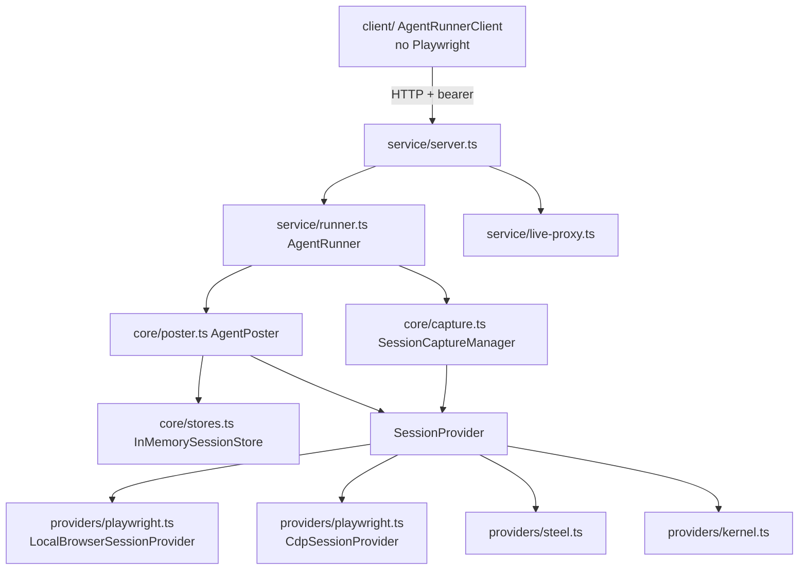
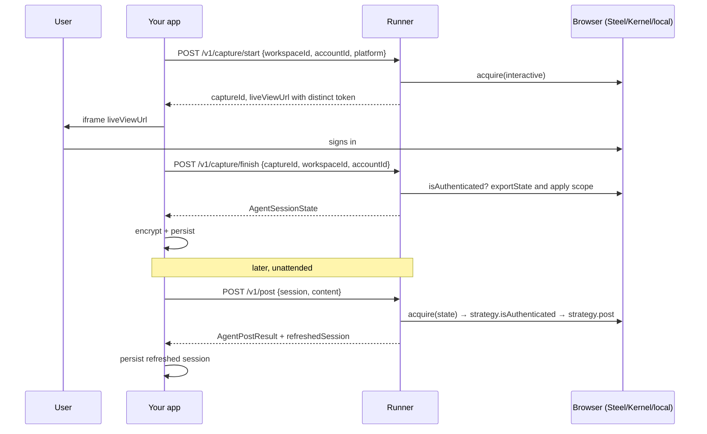

# Architecture

## Layers

- **core** — pure orchestration over the three contracts. No HTTP, no env.
- **providers** — turn a stored session into a live `BrowserContext`. Remote providers create a browser via REST, connect over CDP, inject `storageState`, and dispose/release on close.
- **service** — env-driven runner: chooses providers per job type, registers the caller's strategies, exposes typed handlers and the HTTP server; proxies Steel's live view.
- **client / protocol** — the wire contract. Everything an orchestrator needs without pulling Playwright into its bundle.

## Session and execution policy

`WebPostStrategy.policy` can constrain both execution mode and serialized session
scope. When `policy.session` is present, ABR filters cookies by allowed domain and
local storage by exact origin before a provider sees the state and again before
captured/refreshed state leaves the runtime. Empty and dangerously broad cookie
scopes are rejected.

`allowInteractiveCapture` and `allowUnattended` are independent. This supports,
for example, an interactive-only strategy without implying that a captured
session may be replayed unattended. Omitted policy fields preserve compatibility
for trusted legacy strategies.

## Session lifecycle

The management ID and live-view token are independent credentials. The live
token resolves only the provider view; it cannot finish/cancel a capture or
export state. Capture management succeeds only when the workspace/account
binding matches the start request.

## Audit lifecycle

An optional `AuditSink` receives redacted capture, probe, posting, and
execution-denial events. Events contain platform and tenant identifiers,
timestamps, outcomes, and optionally cookie/origin counts. They never contain
cookie values, local storage, bearer/live-view credentials, screenshots, or
posted content. Sink failures are best-effort and do not expose or interrupt the
browser operation.

## Verification model

A strategy is responsible for proving the action happened. `AgentPostResult` encodes three distinct outcomes so orchestrators can act safely:

| Result | Meaning | Recommended orchestrator behaviour |
|--------|---------|-------------------------------------|
| `ok: true` + `verification` | Action confirmed (toast/permalink or read-back) | Mark done, persist `refreshedSession` |
| `ok: false`, `uncertain: true` | Submit happened but nothing confirmed it | Flag for manual review; **do not** retry or fall back automatically |
| `ok: false`, `needsReauth: true` | Session invalid | Mark account needs re-auth, notify user, optional fallback |
| `ok: false`, `failureStage` ∈ precheck/compose/media | Aborted **before** submitting | Safe to retry or fall back |
| `ok: false`, `failureStage: submit/verify` (not uncertain) | Failed with evidence nothing was posted | Safe to retry/fallback; inspect screenshot |

## Pacing

`AgentPoster` applies a small randomized delay before acting (`pacing: true`) to look human-scale. Per-account rate limits (minimum spacing, hourly caps) belong in the orchestrator where account state lives; the runner is stateless.

## Provider selection

`RunnerConfig.jobProvider` and `captureProvider` are independent. Typical production layout:

- jobs → `local` (parallel, fresh Chromium per job inside the runner container)
- capture → `steel` (live view) or `kernel` (headful browser with live view URL)

`SerializedProvider` wraps single-session backends (Steel OSS) with a mutex so concurrent requests queue instead of failing.
