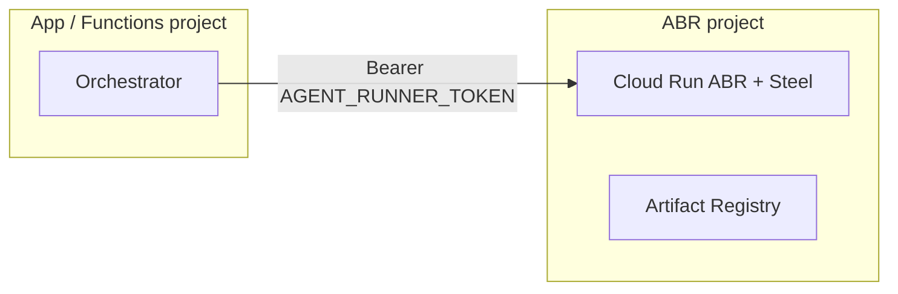

# Deploying and integrating ABR

## Environment

| Variable | Required | Notes |
|----------|----------|-------|
| `AGENT_RUNNER_TOKEN` | yes | ≥ 16 chars; shared with orchestrators |
| `AGENT_RUNNER_PUBLIC_URL` | for capture | Absolute URL users reach the runner at (live view links) |
| `PORT` | no | default 8080. **Do not** set this yourself on Cloud Run — the platform injects it |
| `AGENT_RUNNER_JOB_PROVIDER` | no | `local` (default) · `steel` · `kernel` |
| `AGENT_RUNNER_CAPTURE_PROVIDER` | no | `steel` when `STEEL_API_URL` is set, else `local` |
| `STEEL_API_URL` / `STEEL_API_KEY` | for steel | e.g. `http://127.0.0.1:3000` (sidecar); key only for Steel Cloud |
| `KERNEL_API_KEY` / `KERNEL_API_URL` | for kernel | default `https://api.onkernel.com` |
| `AGENT_RUNNER_CAPTURE_TTL_MS` | no | default 20 min |
| `AGENT_RUNNER_PACING` | no | `false` disables human-pace jitter (tests) |

## Health check

`GET /v1/healthz` (no auth) returns
`{ ok, name, version, repository, jobProvider, captureProvider, activeCaptures }`.

Use **`/v1/healthz`**, not `/healthz`. On Cloud Run (and many L7 frontends) only
paths under `/v1/` are reliably forwarded to the container for external traffic;
startup probes that hit the container port directly can still use either path.

Every JSON response also carries a `Server: agent-browser-runtime/<version> (+repo)` header.

## Local (Docker Compose)

```bash
AGENT_RUNNER_TOKEN=$(openssl rand -base64 32) \
  STRATEGIES_DIR=$PWD/examples/demo-strategy \
  docker compose up --build

curl localhost:8080/v1/healthz
curl -H "authorization: Bearer $AGENT_RUNNER_TOKEN" \
  -H 'content-type: application/json' \
  -d '{}' localhost:8080/v1/probe   # expect 400 validation (auth OK)
```

Steel is exposed on `:3000` (API + live view) and `:9223` (CDP). Only the runtime should reach them in production.

## Container image

`ghcr.io/praveen-palanisamy/agent-browser-runtime:<version>` bundles Node, Playwright's Chromium and the runtime CLI. Extend it with your strategies:

```dockerfile
FROM ghcr.io/praveen-palanisamy/agent-browser-runtime:latest
COPY dist/strategies.js /app/strategies.js
CMD ["serve", "--strategies", "/app/strategies.js"]
```

The image pins `playwright-core` to the base image's Playwright version (`ARG PLAYWRIGHT_VERSION`), verified in CI by `scripts/check-playwright-pin.mjs`, so no browser download happens at runtime.

## Cloud Run (runtime + Steel sidecar)

### Layout

- One service, two containers: the runtime (ingress on `:8080`) and Steel on `localhost:3000`.
- Set `STEEL_API_URL=http://127.0.0.1:3000`, `AGENT_RUNNER_CAPTURE_PROVIDER=steel`, `AGENT_RUNNER_JOB_PROVIDER=local`.
- Interactive captures are stateful (a browser stays open while the user signs in). Prefer `minScale=0` when idle and scale up for capture sessions, or pin `minScale=maxScale=1` only while capture UX is in active use.
- Ingress must be public for the live view; every `/v1/*` API route (except health) is bearer-token protected. Store `AGENT_RUNNER_TOKEN` in Secret Manager and grant the Cloud Run service account `roles/secretmanager.secretAccessor` on that secret. Annotate the revision with `run.googleapis.com/secrets`.
- Steel sidecar: listen on `HOST=0.0.0.0` (not `localhost` — Cloud Run probes need a reachable port), ≥ 2–4 GiB memory, in-memory volume at `/app/.cache`.

### Images in Artifact Registry (not GHCR)

Cloud Run often fails to import GHCR images (`ContainerImageImportFailed`). Mirror Steel into your project's Artifact Registry and reference that:

```bash
podman pull --platform linux/amd64 ghcr.io/steel-dev/steel-browser-api:latest
# authenticate, then:
podman tag … REGION-docker.pkg.dev/PROJECT/REPO/steel-browser-api:latest
podman push …
```

### Podman vs Docker auth

`gcloud auth configure-docker` only wires **Docker's** credential helper. With **Podman**, log in explicitly:

```bash
gcloud auth print-access-token | \
  podman login -u oauth2accesstoken --password-stdin REGION-docker.pkg.dev
```

(Verber Studio's `scripts/lib/artifact-registry-auth.cjs` does this automatically.)

### CPU quota (important)

An always-on sidecar pair (`minScale=1`, 2 CPU runner + 2 CPU Steel ≈ **4 reserved CPUs**) counts against regional Cloud Run CPU quota alongside every Gen2 Cloud Function **in the same GCP project**. That often blocks `firebase deploy --only functions` with:

`Quota exceeded for total allowable CPU per project per region`.

**Recommended:** host ABR in a **dedicated GCP project** (separate 20 vCPU regional pool). Orchestrators (e.g. Firebase Functions in another project) only need `AGENT_RUNNER_URL` + a shared `AGENT_RUNNER_TOKEN`. Peak need for one warm instance with the slim template (1+1 CPU, `minScale=0`) is **~2 vCPU** — one interactive Steel OSS capture at a time.

**Economical default:** keep the agent runner at `minScale=0` (or delete the service) until capture is needed; run headless posts/probes only when the service is scaled up. Prefer requesting a quota increase only after product traffic justifies it.

To free quota quickly:

```bash
gcloud run services delete SERVICE_NAME --region=REGION --quiet
# and/or prune unused revisions:
# (host app) npm run cleanup:cloudrun-revisions
```

### Dedicated project layout (portable)



Images, Secret Manager (`AGENT_RUNNER_TOKEN`), and Cloud Run live in the ABR project. The app project only stores the public URL and the same token value. Swap hosts later (Fly/Railway/GCE) by changing URL + DNS — protocol stays `GET /v1/healthz` and bearer-protected `/v1/*`.

Optional providers (Infisical path `/abr` for agents): `STEEL_API_KEY` (Steel Cloud), `KERNEL_API_KEY` / `KERNEL_API_URL` (Kernel microVMs when `AGENT_RUNNER_*_PROVIDER=kernel`).
### Smoke test

```bash
curl -sS "$AGENT_RUNNER_URL/v1/healthz"
# authenticated probe should return 400 (missing fields), not 401:
curl -sS -X POST "$AGENT_RUNNER_URL/v1/probe" \
  -H "authorization: Bearer $AGENT_RUNNER_TOKEN" \
  -H 'content-type: application/json' -d '{}'
```

## Scaling beyond one instance

- Move captures to **Kernel** (`AGENT_RUNNER_CAPTURE_PROVIDER=kernel`): each capture gets its own microVM with a live view URL, so instances become interchangeable.
- Or run several runner instances with sticky capture routing or an external
  registry that maps both the management ID and the distinct live-view token to
  the owning instance. The two credentials intentionally cannot be correlated
  by clients.

## Ways to consume ABR

| Channel | Best for | Pin |
|---------|----------|-----|
| [npm `@praveen-palanisamy/agent-browser-runtime`](https://www.npmjs.com/package/@praveen-palanisamy/agent-browser-runtime) | embedding the library or client in your app | `^0.1` |
| [GHCR `ghcr.io/praveen-palanisamy/agent-browser-runtime`](https://github.com/praveen-palanisamy/agent-browser-runtime/pkgs/container/agent-browser-runtime) | running the runner service (Chromium included) | `:0.1`, `:latest` |
| [GitHub Action](GITHUB_ACTION.md) | probes and jobs from CI without a service | `@v0` |

Releases are cut automatically from `main`; every semver tag publishes all three channels with provenance. Follow the [Releases page](https://github.com/praveen-palanisamy/agent-browser-runtime/releases) or watch the [changelog](../CHANGELOG.md).
